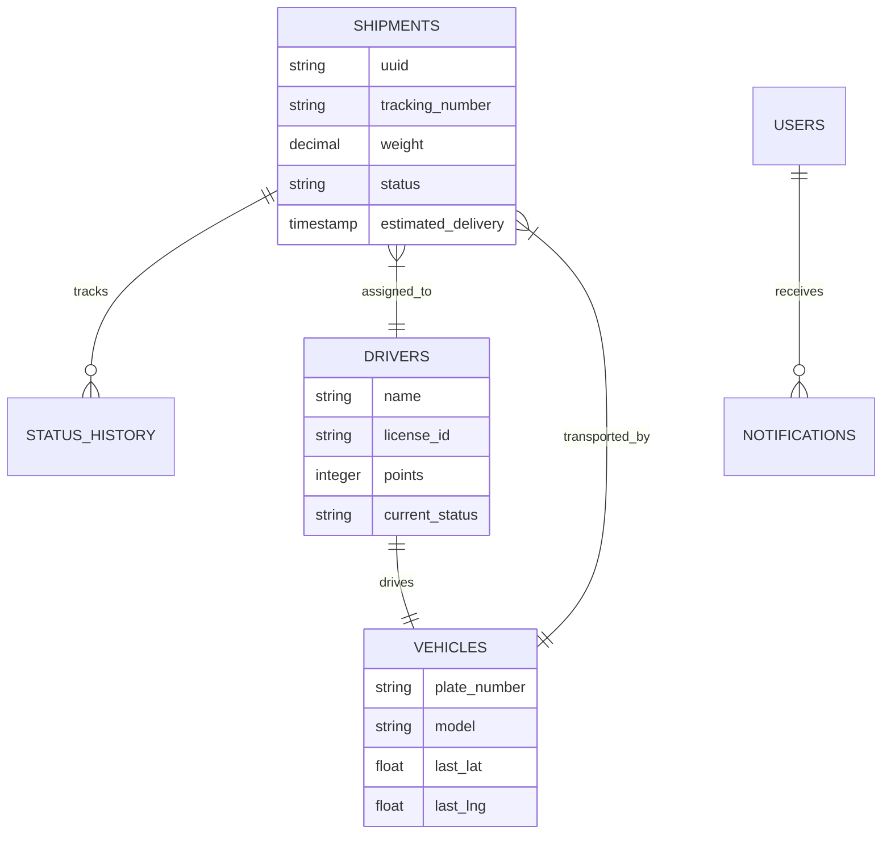

# <div align="center">  <br/> Intelligence in Motion </div>
  

<div align="center">

[](https://laravel.com)
[](https://vuejs.org)
[](https://tailwindcss.com)
[](https://vitejs.dev)

### **Enterprise-Grade Fleet & Logistics Management System**  
*Zaawansowana platforma logistyczna demonstrująca inżynierię oprogramowania na najwyższym poziomie, oparta na architekturze mikro-serwisowej i nowoczesnych wzorcach projektowych.*

[Wideo Demo](#) • [Dokumentacja API](#-dokumentacja-api) • [Przewodnik Instalacji](#-przewodnik-instalacji)

</div>

---

## 📖 Wprowadzenie i Vision Statement

**EcoLogix** to autorski system klasy **Logistics Intelligence**, zaprojektowany do kompleksowej orkiestracji procesów łańcucha dostaw. Projekt nie jest jedynie prostym CRUD-em, lecz kompletnym ekosystemem biznesowym, który rozwiązuje realne problemy logistyczne: optymalizację tras, zarządzanie stanami przesyłek w czasie rzeczywistym oraz grywalizację pracy kierowców w celu zwiększenia efektywności SLA.

---

## 🏛️ Deep Technical Architecture

### Design Patterns & Engineering Excellence
System został zbudowany zgodnie z paradygmatem **Clean Architecture**, izolując logikę domeny od infrastrukury:

- **State Machine Strategy:** Proces przesyłki jest zarządzany przez maszynę stanów. Każda zmiana statusu (np. `In Transit` do `Delayed`) przechodzi przez rygorystyczne walidatory biznesowe, uniemożliwiając nielegalne przejścia stanów.
- **Service Layer Pattern:** Kontrolery API pełnią jedynie rolę entry-pointów. Cała "ciężka" logika biznesowa, jak obliczanie kosztów czy geocoding, została wydelegowana do dedykowanych serwisów.
- **DTOs (Data Transfer Objects):** Ustandaryzowany przepływ danych między warstwami, zapewniający rygorystyczne typowanie i eliminujący błędy typu "undefined index".
- **Real-time Event-Driven:** Pełne wykorzystanie **Laravel Reverb** i WebSockets. Każda zmiana pozycji pojazdu na mapie jest rozgłaszana do subskrybowanych klientów w milisekundach.

### � Database Schema (ERD)



---

## 🚀 Kluczowe Moduły Biznesowe

### 1. Intelligence Dashboard (Pro)
Zaawansowany panel analityczny oferujący wgląd 360° w operacje:
- **KPI Engine:** Agregacja danych w czasie rzeczywistym (wskaźnik dostaw na czas, średnie spalanie floty, przychody).
- **Predictive Analytics:** Wizualizacja trendów z wykorzystaniem **Chart.js**, pozwalająca na przewidywanie wąskich gardeł w łańcuchu dostaw.

### 2. Live Fleet Monitoring
Interaktywny system kontroli floty:
- **Geographic Information System (GIS):** Autorska integracja Leaflet.js z warstwami ruchu drogowego i pogody.
- **Vehicle Telemetry:** Symulacja i wizualizacja danych GPS przesyłanych z pojazdów w ruchu.

### 3. Logistical Operations
- **Smart Routing:** Silnik logiczny dopasowujący wagę i gabaryty przesyłki do odpowiedniej klasy pojazdu.
- **Cost Calculator:** Algorytm dynamicznej wyceny uwzględniający dystans, priorytet oraz parametry ekologiczne (Eco-routing).

---

## 👥 User Stories & Scenarios

| Rola | Perspektywa | Cel Biznesowy |
| :--- | :--- | :--- |
| **Dyspozytor** | Jako koordynator floty... | ...chcę śledzić wszystkie pojazdy na mapie live, aby móc szybko reagować na opóźnienia i wypadki drogowe. |
| **Manager** | Jako osoba decyzyjna... | ...potrzebuję wglądu w raporty wydajności (Leaderboard), aby optymalnie nagradzać najbardziej efektywnych kierowców. |
| **Kierowca** | Jako operator pojazdu... | ...chcę widzieć moją trasę i zdobywać punkty za bezpieczną, ekologiczną jazdę w celu awansu w rankingu firmy. |

---

## 💻 Technical Stack & DevOps

### 🔵 Backend (The Engine)
- **Framework:** Laravel 11 (PHP 8.3) - wykorzystanie **Promotion Properties** i **Readonly Classes**.
- **Baza Danych:** PostgreSQL - zaawansowane relacje i indeksowanie przestrzenne.
- **Caching & Queue:** Redis - asynchroniczne przetwarzanie powiadomień i logiki geocodingu.

### 🥬 Frontend (The Interface)
- **Framework:** Vue 3 (Composition API) - wysoka reaktywność i modularność.
- **State Management:** Pinia - profesjonalne zarządzanie stanem globalnym.
- **Styling:** Tailwind CSS + Custom Animations - unikalny Design System "Emerald Night".

---

## 📡 Dokumentacja API (Standard Przemysłowy)

API EcoLogix przestrzega standardów **JSON:API**.

```bash
# Pobieranie geolokalizacji konkretnego pojazdu
GET /api/v1/vehicles/{id}/location

# Autoryzacja i inicjalizacja sesji operatorskiej
POST /api/v1/auth/login
```

---

## 🗺 Roadmap i Kierunki Rozwoju

System jest ciągle rozwijany. Kolejne etapy to:
- **Faza 7: AI Route Optimizer** – Wdrożenie uczenia maszynowego do przewidywania najszybszych tras na podstawie historycznych danych o korkach.
- **Faza 8: Mobile Driver App** – Natywna aplikacja mobilna dla kierowców z czytnikiem kodów kreskowych i podpisem cyfrowym.
- **Faza 9: IoT Integration** – Bezpośrednie połączenie z trackerami OBD-II w ciężarówkach.

---

## 🛠 Przewodnik Instalacji (Wersja Deweloperska)

Projekt korzysta z Dockera i Vite, zapewniając nowoczesne środowisko pracy.

```bash
# 1. Klonowanie i wejście do katalogu
git clone https://github.com/Konalexon/EcoLogix.git && cd EcoLogix

# 2. Instalacja zależności Backend i Frontend
composer install && npm install

# 3. Konfiguracja środowiska
cp .env.example .env && php artisan key:generate

# 4. Przygotowanie bazy danych z danymi DEMO
php artisan migrate --seed

# 5. Uruchomienie deweloperskie (Hot Reloading)
npm run dev & php artisan serve
```

---

<div align="center">

**Enterprise Logistics Solution Engineering by [Konalexon](https://github.com/Konalexon)**

[⚽ Powrót na Górę](#-ecologix---intelligence-in-motion)

</div>
           